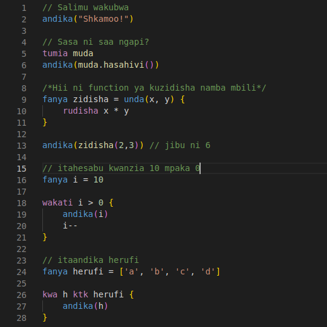

# Jambo VSCode Extension

This is a syntax highliting extension for Jambo on vscode. It detects `.jb` and `.sw` files.

## Screenshots

## How To Install

### Download From Market Place

- Simply download the Jambo Extension from VSCode Market Place

### Windows

- Copy the whole [jambo folder](https://github.com/spaceadh/Jambo/tree/main/extensions/vscode/jambo) and paste it in the VSCode extensions directory found in `%USERPROFILE%\.vscode\extensions`
- Restart VSCode

### Linux and MacOS

- Copy the whole [jambo folder](https://github.com/spaceadh/Jambo/tree/main/extensions/vscode/jambo) and paste it in the VSCode extensions directory found in `~/.vscode/extensions`
- Restart VSCode
